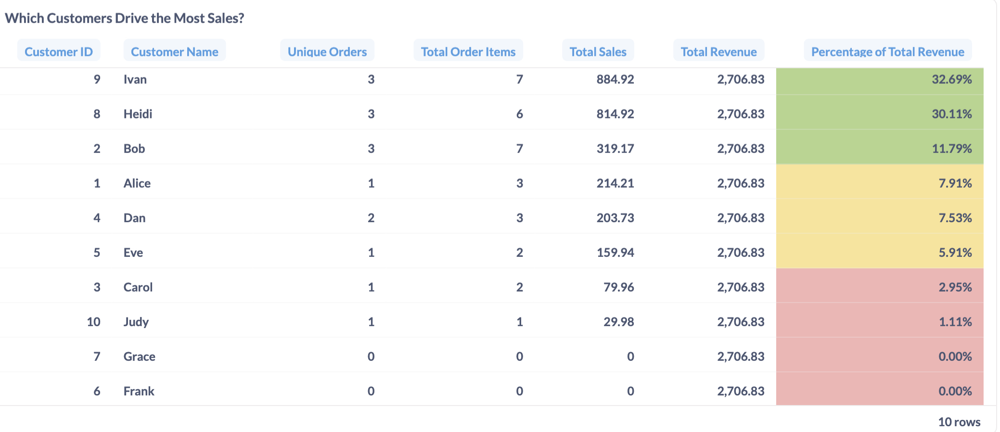
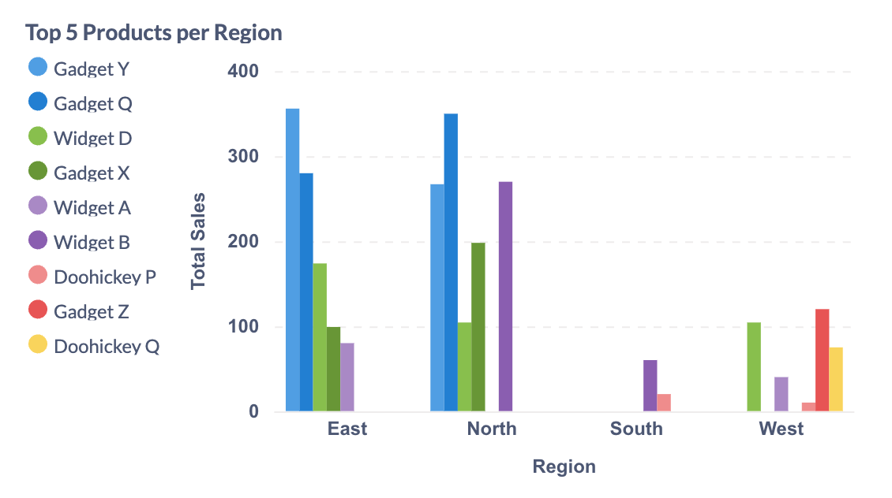
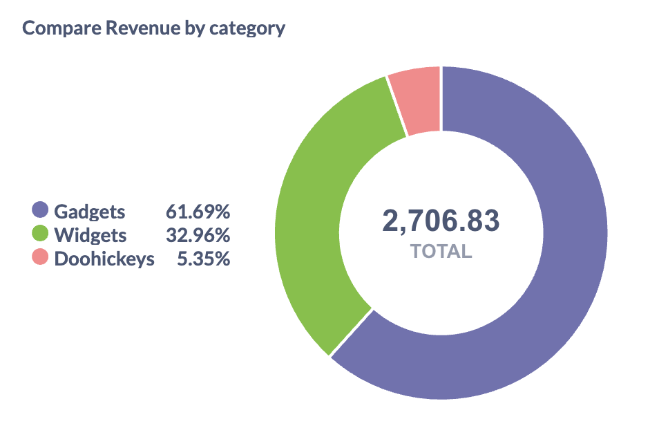
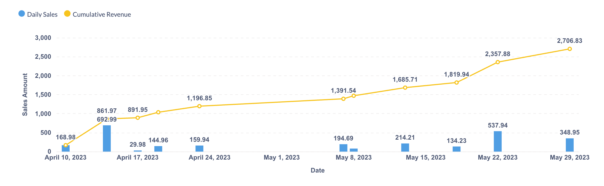
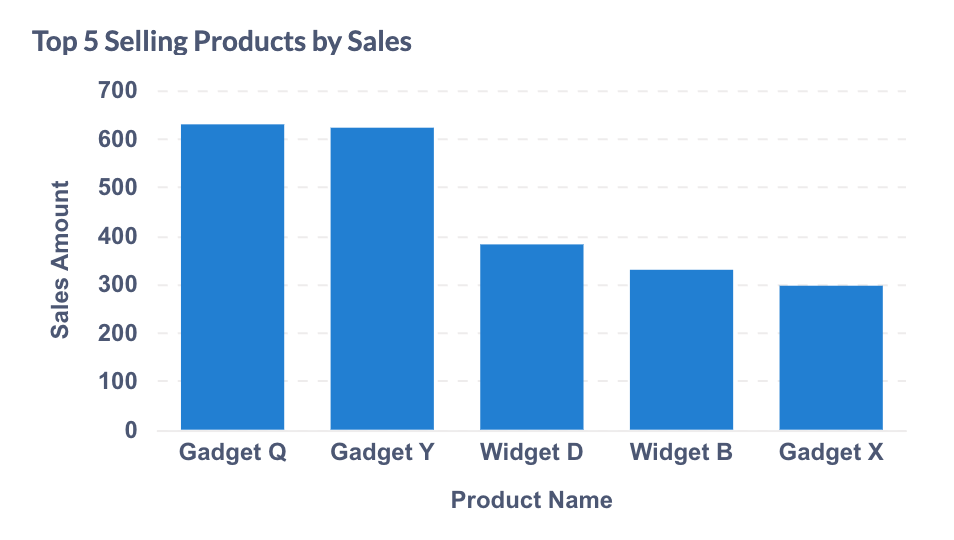

# Mini E-commerce Analytics Project

## Description
This project simulates a real-world data engineering workflow using synthetic (non-sensitive) e-commerce sales data. It showcases the end-to-end process of ingesting, storing, and visualizing data with PostgreSQL, pgAdmin, Metabase, and Docker.

## Project Goals

The objective is to gain hands-on, practical experience with key tools in the modern data engineering stack by recreating a simplified version of a data pipeline. This project is part of my personal learning journey to reinforce concepts learned from DataCamp and LinkedIn Learning.

## Tech Stack
| Tool                        | Purpose                                                                                                           |
| --------------------------- | ----------------------------------------------------------------------------------------------------------------- |
| **PostgreSQL**              | Relational database used to store structured e-commerce data                                                      |
| **pgAdmin**                 | Web-based GUI tool to interact with and manage the PostgreSQL database                                            |
| **Metabase**                | Data visualization tool used for data exploration and building dashboards                                         |
| **Docker & Docker Compose** | Containerized setup to run PostgreSQL, pgAdmin, and Metabase in isolated, reproducible environments               |
| **SQL**                     | Used for data transformation, aggregation and analysis                                                            |

## Project Architecture

The diagram below illustrates the overall architecture of this project and how each component interacts with one another.


## 🛠️ Setup & Getting Started 

To run this project locally:

1. **Clone the repository**:
```bash
   git clone https://github.com/matchng/mini_ecom_analytic.git
   cd mini_ecom_analytic
```

2. **Create your own environment file**
    Copy the .env example file and customize it as needed.
```bash
    cp .env.example .env
```

3. **Start the services using Docker Compose**
```bash 
    docker compose up --build
```
4. **Access the tools:**
    pgAdmin: http://localhost:8080
    Metabase: http://localhost:3000

## Data Ingestion & Preparation

1. **Load Raw Data into PostgreSQL**

Use the SQL scripts to create the schema and import the sample data via pgAdmin or psql:

```bash
psql -h localhost -U {POSTGRES_USER} -d ecommerce -f sql/create_table.sql
psql -h localhost -U {POSTGRES_USER} -d ecommerce -f sql/load_data.sql
```
These scripts create staging tables and populate them with simulated e-commerce data.

2. **Clean & Transform the Data**

Run the transformation script to create a cleaned data warehouse layer:

```bash 
psql -h localhost -U {POSTGRES_USER} -d ecommerce -f sql/create_warehouse.sql
```

This step creates dimension and fact tables including dim_customers, dim_products and fact_orders for downstream analytics.

3. **Explore the Data**

sql/analytics.sql contains all the queries I have used for my analysis the data and create Metabase charts

## 📊 Metabase Dashboards & Insights

Below are the key visualizations and insights created in Metabase.

### 1. Top Customers by Revenue Contribution  
- **Question:** *Which customers generate the most sales, and what share of total revenue do they each account for?*
  
- **Insight:** Ivan (32.7%) and Heidi (30.1%) together drive over 60% of total revenue.  

---

### 2. Top 5 Products by Region 
- **Question:** *What are the top-selling products in each region?* 
  
- **Insight:** In East/North regions, Gadget Q & Gadget Y dominate; South is led by Widget B; West by Widget D & Gadget Z.  

---

### 3. Sales Breakdown by Product Category 
- **Question:** *How is total revenue distributed across product categories?* 
  
- **Insight:** Gadgets account for 61.7%, Widgets 33.0%, Doohickeys 5.3% of total revenue.  

---

### 4. Daily Sales & Cumulative Revenue Over Time  
- **Question:** *How does daily revenue fluctuate, and how does that add up over the period?*
  
- **Insight:** Steady revenue growth from April to May, with spikes on Apr 14 (≈693) and May 22 (≈538); cumulative hits 2,706.83.  

---

### 5. Top 5 Products by Total Sales 
- **Question:** *Which products generated the most revenue overall?* 
  
- **Insight:** Leading products are Gadget Q (~630), Gadget Y (~623), Widget D (~382), Widget B (~330), Gadget X (~297).  

---

